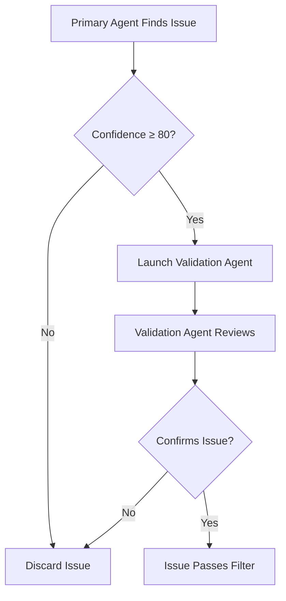

# Agent Orchestration for Local Code Review

This document details the multi-agent orchestration system used for comprehensive code review with confidence-based filtering.

## Agent Architecture Overview

The local code review skill uses a **4 + N agent architecture**:

```
┌─────────────────┐    ┌─────────────────┐
│ CLAUDE.md Agent │    │ CLAUDE.md Agent │
│   (Sonnet)      │    │   (Sonnet)      │
└─────────┬───────┘    └───────┬─────────┘
          │                    │
          └─────────┬──────────┘
                    │
          ┌─────────▼─────────┐
          │  Bug Agent        │
          │   (Opus)          │
          └─────────┬─────────┘
                    │
          ┌─────────▼─────────┐
          │  Logic Agent      │
          │   (Opus)          │
          └─────────┬─────────┘
                    │
          ┌─────────▼─────────┘
          │  Validation Layer
          │  (N subagents)
          └───────────────────►
```

## Primary Review Agents

### Agent 1 & 2: CLAUDE.md Compliance Agents (Sonnet)

**Purpose**: Audit code changes against project guidelines and standards.

**Input**:

- Modified file list and their contents
- Relevant CLAUDE.md files (project root + directory-specific)
- Change context and intent

**Responsibilities**:

- Verify compliance with documented coding standards
- Check for consistency with existing codebase patterns
- Identify violations of project-specific rules
- Validate that guidelines are appropriately scoped

**Output Format**:

```json
{
  "issues": [
    {
      "type": "claude_md_violation",
      "file": "src/auth/login.ts",
      "lines": "67-72",
      "description": "Missing error handling for OAuth callback",
      "rule": "Always handle OAuth errors gracefully",
      "confidence": 95,
      "evidence": "CLAUDE.md section 3.2 requires error handling for external API calls"
    }
  ]
}
```

### Agent 3: Bug Detection Agent (Opus)

**Purpose**: Identify obvious programming errors and bugs in changed code.

**Focus Areas**:

- Syntax errors and compilation issues
- Type errors and undefined references
- Logic errors that will cause runtime failures
- Resource management issues (memory leaks, unclosed handles)

**Filtering Criteria**:

- Only flags issues visible in the diff
- Ignores pre-existing problems
- Requires high confidence (>80%) for reporting

### Agent 4: Logic Analysis Agent (Opus)

**Purpose**: Analyze code logic and identify potential runtime issues.

**Analysis Areas**:

- Control flow problems
- Data validation gaps
- Security vulnerabilities
- Performance issues with clear impact
- Edge case handling

## Validation Layer

### Purpose

The validation layer prevents false positives by having additional agents verify each issue found by the primary agents.

### Validation Process



### Validation Agent Types

**For CLAUDE.md Issues**:

- Use Sonnet agents for guideline interpretation
- Verify rule applicability to specific file/directory
- Confirm violation exists in current code

**For Bug/Logic Issues**:

- Use Opus agents for technical analysis
- Validate that the issue actually exists
- Check if it's a false positive or pre-existing problem

## Confidence Scoring System

### Scoring Guidelines

**100 - Absolutely Certain**

- Syntax error that prevents compilation
- Undefined variable reference
- Import of non-existent module
- Clear violation of documented rule

**90-99 - Very High Confidence**

- Logic error with predictable failure
- Security vulnerability with exploit path
- Resource leak in error path
- Type mismatch in strongly typed language

**80-89 - High Confidence**

- Potential null pointer exception
- Missing error handling in critical path
- Inconsistent with established patterns
- Edge case not handled

**70-79 - Moderate Confidence (Filtered Out)**

- Code style inconsistency
- Minor performance concern
- Could be improved but works
- Subjective quality issue

**< 70 - Low Confidence (Filtered Out)**

- Nitpicky style preferences
- Hypothetical edge cases
- Personal opinions
- Pre-existing issues

## Parallel Execution Strategy

### Agent Coordination

```python
import asyncio
from typing import List, Dict

async def parallel_review(changes: Dict) -> List[Issue]:
    """Execute all review agents in parallel."""

    # Launch all agents simultaneously
    tasks = [
        claude_md_agent_1(changes),
        claude_md_agent_2(changes),
        bug_detection_agent(changes),
        logic_analysis_agent(changes)
    ]

    # Wait for all to complete
    agent_results = await asyncio.gather(*tasks)

    # Flatten results
    all_issues = []
    for result in agent_results:
        all_issues.extend(result.get('issues', []))

    return all_issues
```

### Timeout Handling

```python
async def run_with_timeout(agent_func, timeout_seconds=120):
    """Run agent with timeout to prevent hanging."""
    try:
        return await asyncio.wait_for(
            agent_func(),
            timeout=timeout_seconds
        )
    except asyncio.TimeoutError:
        return {"issues": [], "error": "Agent timeout"}
```

## Result Aggregation

### Issue Deduplication

```python
def deduplicate_issues(issues: List[Issue]) -> List[Issue]:
    """Remove duplicate issues from different agents."""

    seen = set()
    unique_issues = []

    for issue in issues:
        # Create unique key from file, lines, and description
        key = f"{issue['file']}:{issue['lines']}:{hash(issue['description'])}"

        if key not in seen:
            seen.add(key)
            unique_issues.append(issue)

    return unique_issues
```

### Confidence-Based Filtering

```python
def filter_by_confidence(issues: List[Issue], threshold=80) -> List[Issue]:
    """Filter issues below confidence threshold."""
    return [
        issue for issue in issues
        if issue.get('confidence', 0) >= threshold
    ]
```

## Error Handling and Resilience

### Agent Failure Handling

```python
def handle_agent_failure(agent_name: str, error: Exception) -> Dict:
    """Handle agent failures gracefully."""
    return {
        "agent": agent_name,
        "issues": [],
        "error": str(error),
        "status": "failed"
    }
```

### Partial Result Processing

- If one agent fails, continue with others
- Log failures but don't stop entire review
- Provide partial results when possible

## Performance Optimization

### Agent Resource Allocation

- **CLAUDE.md Agents**: Use Sonnet for better guideline understanding
- **Bug Agents**: Use Opus for complex logic analysis
- **Validation Agents**: Match primary agent model type

### Caching Strategy

- Cache CLAUDE.md file contents during review
- Avoid re-reading same files multiple times
- Share file contents between agents when possible

### Scalability Considerations

- Limit concurrent agents based on API rate limits
- Batch large reviews into smaller chunks
- Prioritize critical files for immediate review

## Quality Assurance

### Agent Calibration

Regular testing against known good/bad code to ensure:

- False positive rate < 5%
- True positive rate > 95%
- Confidence scores accurately reflect issue severity

### Continuous Improvement

- Track agent performance metrics
- Update prompts based on review patterns
- Refine confidence scoring guidelines

## Integration Points

### Development Workflow Integration

```bash
# Pre-commit hook
claude "review staged changes"

# CI/CD pipeline
claude "review changes since main"

# IDE integration
# Trigger on file save for modified files
```

### Configuration Override

Allow project-specific configuration:

```yaml
# .claude/code-review-config.md
---
confidence_threshold: 85
exclude_patterns:
  - '**/*.generated.*'
focus_areas:
  - security: true
  - performance: false
---
```
