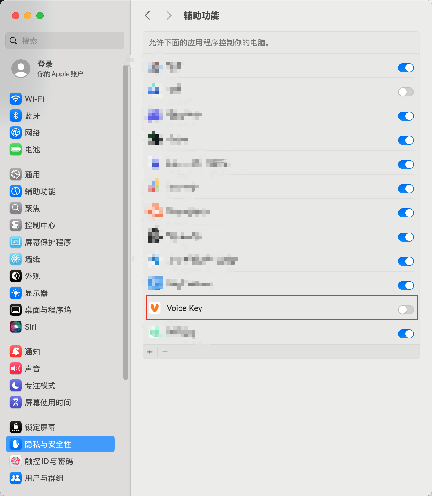

[English](./README_EN.md)

# Voice Key

Voice Key 是一款开源的的桌面端语音输入产品。

## 主要功能

- **语音转写**: 集成 GLM ASR (智谱AI) 实现高精度的语音转文字。

## 配置要求

本应用依赖 **智谱 AI (GLM)** 的语音转写服务。使用前请务必配置 API Key。

1. **获取 API Key**: 访问智谱 AI 开放平台[中国版](https://bigmodel.cn/usercenter/proj-mgmt/apikeys) 或者 [国际版](https://z.ai/manage-apikey/apikey-list) 注册并获取 Key。
2. **配置**: 打开 Voice Key 设置页面，填入你的 API Key。

## macOS 安装指南

由于应用未签名（我们还没有注册 Apple 开发者账户），安装后需执行以下步骤：

1. **解除安全限制**  
   若打开应用提示“文件已损坏”，请在终端运行以下命令：

   ```bash
   xattr -cr /Applications/Voice\ Key.app
   ```

   

2. **授予辅助功能权限**  
   应用需要监听按键与模拟输入。请前往 **系统设置 > 隐私与安全性 > 辅助功能** 开启 **Voice Key**。
   
   

## 开源协议

本项目采用 [Elastic License 2.0](LICENSE) 开源协议。
